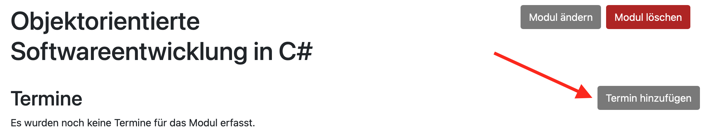
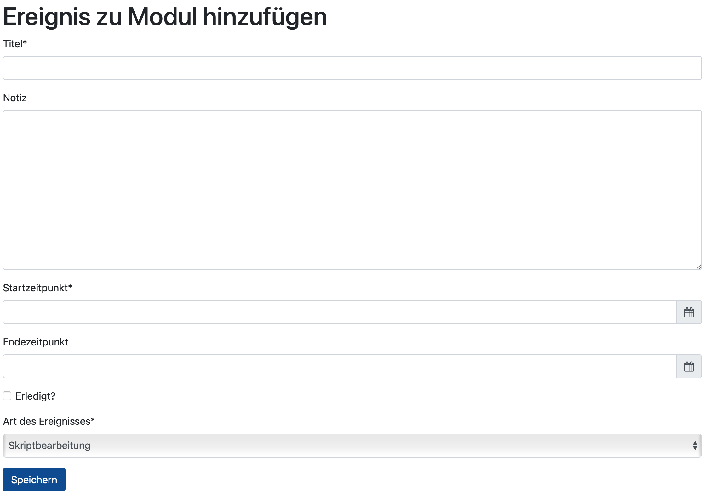
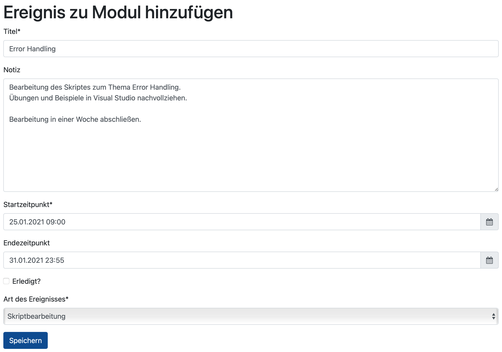
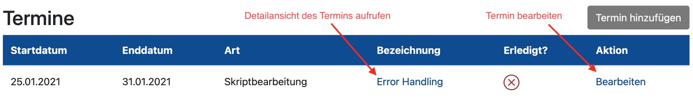
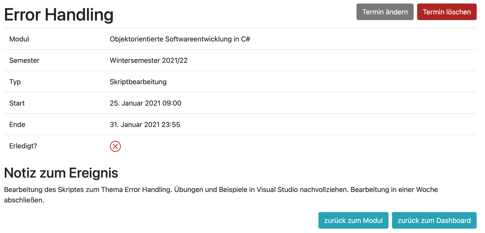
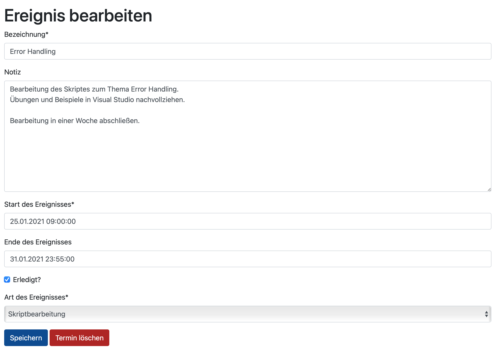

Termine verwalten
======================================================================

Termine hinzufügen
----------------------------------------------------------------------

Über die Detailansicht eines Moduls, können Termine hinzugefügt werden.

Im Formular können Titel des Termins (kurze Beschreibung) eine Notiz mit beliebiger Länge und die
Art des Ereignisses hinzugefügt werden.

Für die verschiedenen Arten von Ereignissen steht eine fest definierte DropDown Liste zur Verfügung.

Bei der Auswahl des Datums, hilft ein Widget bei der Eingabe.
Die Angabe eines Datums für den Startzeitpunkt des Termins ist eine Pflichtangabe.
Ein Termin für das Ende ist allerdings optional.

So ist es möglich, beispielsweise für eine Bearbeitung des Skriptes einen mehrtägigen Termin anzulegen.

Beispiel für einen mehrtägigen Termin:

Nach Speicherung des Termins gelangt man zur Detailansicht des Moduls zurück.

Hier wird der Termin nun in der Übersicht angezeigt.

Termine bearbeiten / Detailansicht
----------------------------------------------------------------------

Über die Detailansicht des Moduls und der darin enthaltenen Übersicht der Termine,
gelangt man in die Detailansicht eines Termins oder in dessen Bearbeitung.

In der Detailansicht zum Termin, werden alle Details entsprechend angezeigt.

Über die Bearbeitung, kann ein Termin entsprechend verschoben oder als erledigt markiert werden.
Zudem ist es hier möglich einen Termin zu löschen.

