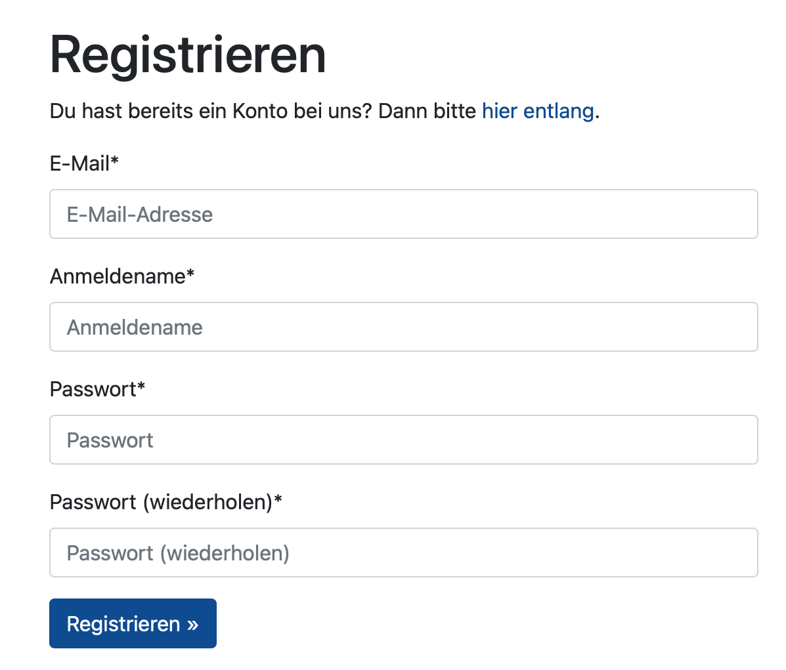
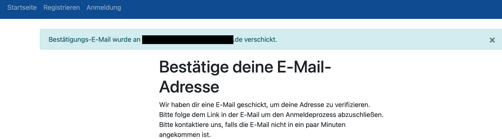
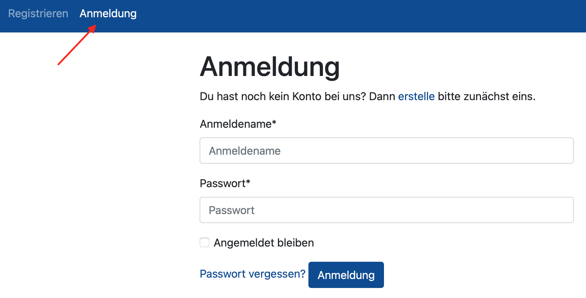
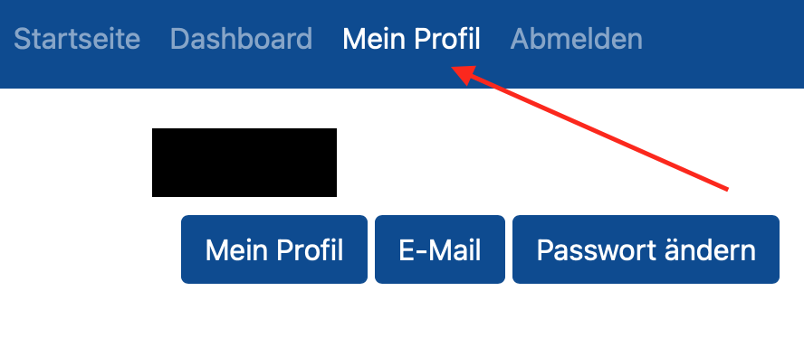

Registrierung und Anmeldung
======================================================================

Registrierung
----------------------------------------------------------------------

Zur Registrierung und Anlage eines Benutzerkontos sind Benutzername, E-Mail und
Passwort erforderlich.
Weitere Daten sind für die Nutzung der Applikation nicht erforderlich.

Nach erfolgter Registrierung, wird eine E-Mail an die angegebene E-Mail Adresse gesendet.
Dadurch wird die E-Mail Adresse entsprechend bestätigt.
Erst nach erfolgter Bestätigung der E-Mail, kann die Applikation genutzt werden.

Anmeldung
----------------------------------------------------------------------

Der Login bzw. die Anmeldung funktioniert über den Menüpunkt "Anmeldung".

Insofern der Login für den nächsten Aufruf der Seite erhalten bleiben soll,
kann die Checkbox "Angemeldet bleiben" aktiviert werden.

Dadurch ist beim nächsten Besuch der Seite keine erneute Anmeldung erforderlich.

Benutzerprofil
----------------------------------------------------------------------

Über den Menüpunkt "Mein Profil" kann das eigene Benutzerkonto verwaltet werden.
So ist es möglich neue E-Mail Adressen zu hinterlegen bzw. die bestehende auszutauschen
oder ein neues Passwort festzulegen.

Soll die E-Mail getauscht werden, ist es erforderlich zunächst eine neue E-Mail
Adresse zu hinterlegen, bevor die alte (primäre) E-Mail Adresse gelöscht werden kann.

Zudem kann optional ein Name, zusätzlich zum Benutzernamen, hinterlegt werden.

