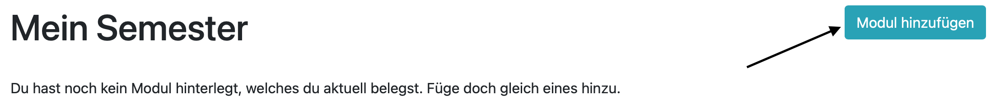
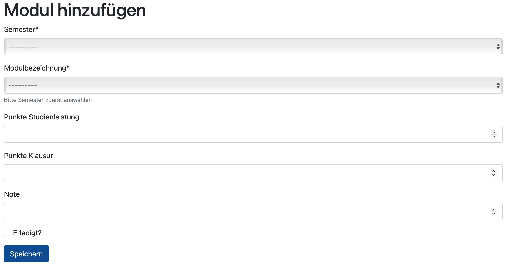
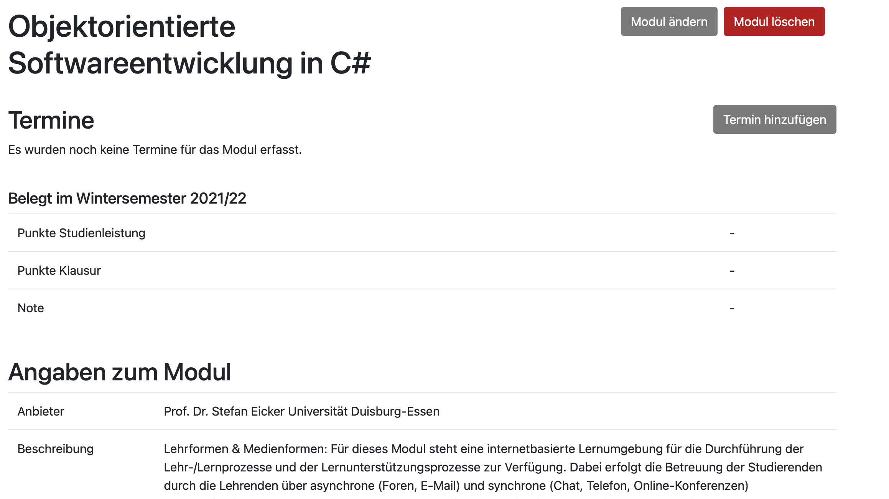
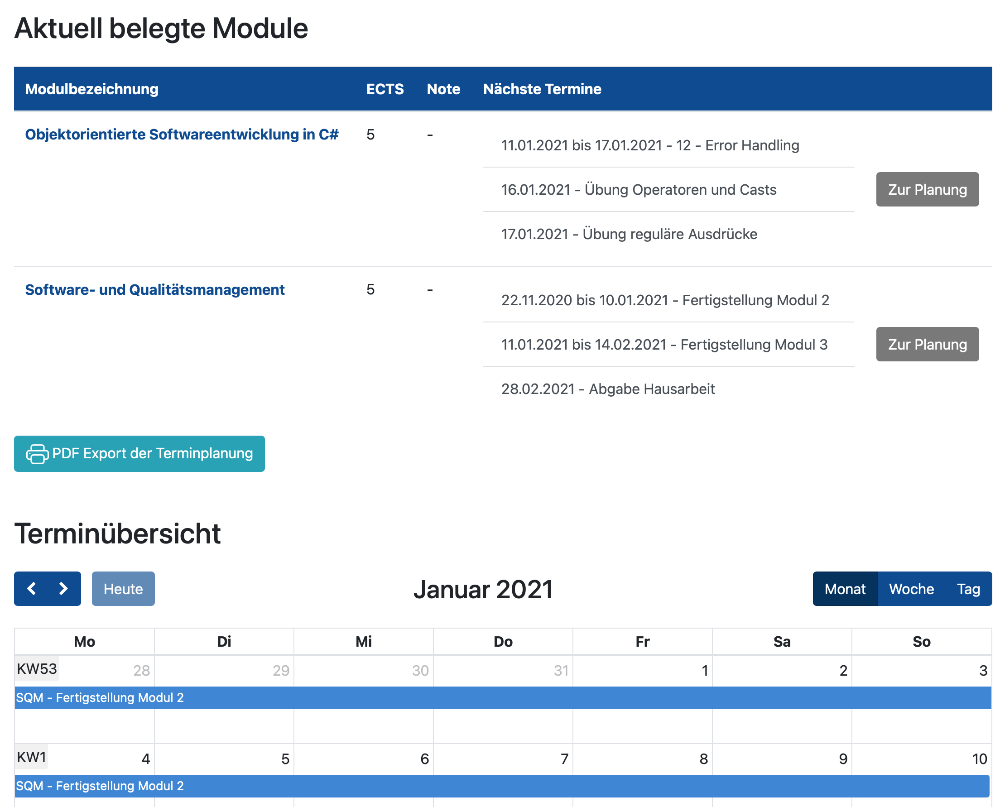
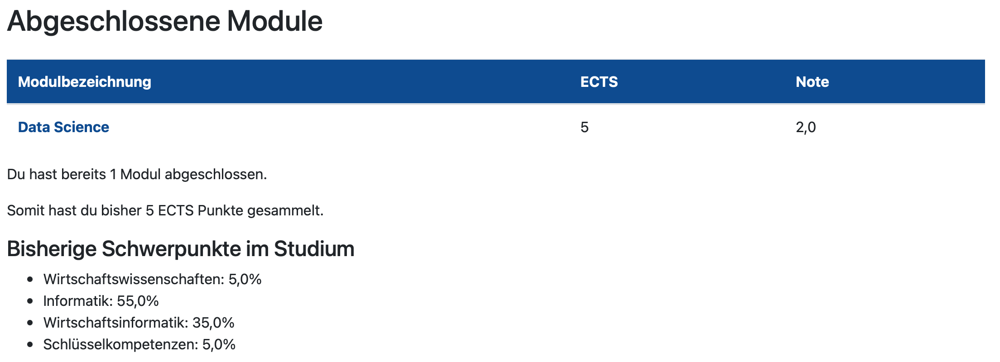

Module verwalten
======================================================================

Module hinzufügen
----------------------------------------------------------------------

Zu Beginn ist das `Dashboard <https://www.vawi-planer.de/semester/>`_ komplett leer.
Im ersten Schritt müssen Module hinzugefügt werden.
Über den Button "Modul hinzufügen" gelangt man in die entsprechende Ansicht.

Im Formular können nun die relevanten Informationen zum Modul hinzugefügt werden.
Zunächst sollte das Semester ausgewählt werden, da anhand des Semesters die Auswahl an möglichen Modulen
automatisch eingeschränkt wird.

Nach Auswahl des Semesters, kann über die DropDown Liste das gewünschte Modul ausgewählt werden.

Insofern ein Modul bereits abgeschlossen ist oder bereits Punkte für Studienleistungen oder Klausuren
vorliegen, können diese ebenfalls erfasst werden

Zudem kann die Note hinterlegt werden und das Modul als abgeschlossen markiert werden.
Abgeschlossene Module sind im Dashboard gesondert aufgeführt und bieten eine gute Übersicht, über die
bereits erledigten Module bei VAWi.

Nachdem das Modul erfasst wurde, gelangt man zur Detailansicht des Moduls. Hier können
weitere Aktionen vollzogen werden, wie z.B. die Erfassung von Terminen zum Modul.

Zudem ist es möglich jederzeit ein Modul wieder zu löschen oder zu bearbeiten, um
beispielsweise Angaben zu Punkten in Studienleistungen, Punkte zu Klausuren oder
Noten zu hinterlegen.

Sobald ein Modul abgeschlossen ist, sollte das Modul ebenfalls über den Button "Modul ändern"
als abgeschlossen marktiert werden.

In der Detailansicht, werden zudem weitere Informationen zum Modul eingeblendet. Hier werden die
Beschreibung des Moduls aus dem Modulhandbuch augeführt oder aber die Anteile an Kompetenzen aufgeführt.

Dashboard
----------------------------------------------------------------------

Das Dashboard ist der zentrale Einstiegspunkt in die Applikation nach Anmeldung.

Im oberen Teil sind die aktuellen Module aufgeführt.
Alle nicht abgeschlossenen Module sind hierin enthalten.
Zudem werden zu jedem Modul, die nächsten drei offenen Termine angezeigt.

Darunter befindet sich ein Kalenderwidget. Dieser Kalender zeigt alle offenen Termine an.
Es kann bequem zwischen den Monaten gewechselt werden. Zudem sind Wochen- und Tagesansichten
verfügbar.

Die Terminübersicht im Kalender ist eine reine Anzeige von Terminen. Allerdings kann
über das Kalenderwidget auch direkt auf den jeweiligen Termin, mit all seinen Details verzweigt werden.

Somit ist eine leichte Navigation möglich und der Termin kann entsprechend bearbeitet werden.

Unter dem Kalenderwidget befindet sich eine Tabelle mit offenen Terminen. Diese Tabelle ist eine
alternative Ansicht und zeigt die Termine als Liste an.

Abgeschlossene Module
----------------------------------------------------------------------

Abgeschlossene Module werden auf dem Dashboard im unteren Teil angezeigt.
Sie werden tabellarisch mit der jeweiligen Abschlussnote dargestellt.

Zudem werden die gesammelten ECTS Punkte berechnet und die Anzahl an
abgeschlossenen Modulen ermittelt.

Die bisherigen Schwerpunkte werden ebenfalls berechnet. Dazu werden die Anteile der Kompetenzen pro
Modul aus dem Modulhandbuch herangezogen. Über alle belegten Module wird der entsprechende
Durchschnitt berechnet.

